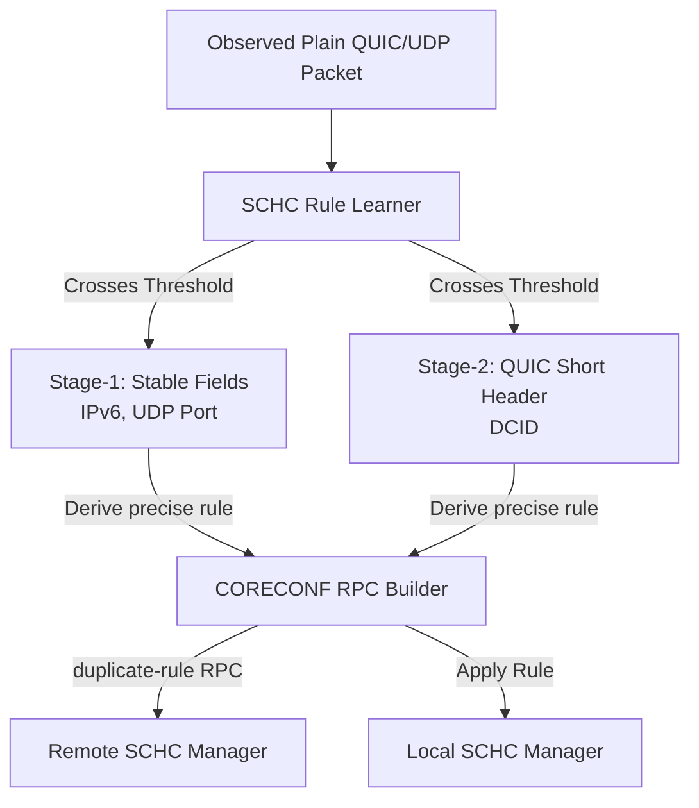

# QUIC Workbench

A command-line application to simulate QUIC connections in different scenarios (network topology and
QUIC parameters). The simulation creates one or more connections, issues a fixed number of requests
from the client to the server, and streams the server's responses back to the client.

## Features

- Pure. No IO operations are made, everything happens in-memory within a single process.
- Time warping. The simulation's internal clock advances automatically to the next event, making the
  simulation complete in an instant (even in the presence of deep-space-like RTTs).
- Deterministic. Two runs with the same parameters yield the same output.
- Inspectable. Next to informative command-line output and statistics, the application generates a
  synthetic pcap file, so you can examine the traffic in more detail using Wireshark.
- Configurable network settings and QUIC parameters through reusable JSON config files (see
  `test-data` and [JSON config details](#json-config-details)).
- Configurable simulation behavior through command-line arguments (see `cargo run --release -- --help`).

## Getting started

After [installing Rust](https://rustup.rs/), you can get started with:

```bash
cargo run --release --bin quinn-workbench -- \
  quic \
  --network-graph test-data/earth-mars/networkgraph-fullmars.json \
  --network-events test-data/earth-mars/events.json \
  --client-ip-address 192.168.40.1 \
  --server-ip-address 192.168.43.2
```

Here's an example issuing a single request and receiving a 10 MiB response:

```bash
cargo run --release --bin quinn-workbench -- \
  quic \
  --network-graph test-data/earth-mars/networkgraph-fullmars.json \
  --network-events test-data/earth-mars/events.json \
  --client-ip-address 192.168.40.1 \
  --server-ip-address 192.168.43.2 \
  --requests 1 --response-size 10485760
```

Here's an example controlling the random seeds (which otherwise use a hardcoded constant):

```bash
cargo run --release --bin quinn-workbench -- \
  quic \
  --network-graph test-data/earth-mars/networkgraph-fullmars.json \
  --network-events test-data/earth-mars/events.json \
  --client-ip-address 192.168.40.1 \
  --server-ip-address 192.168.43.2 \
  --network-rng-seed 1337 \
  --quinn-rng-seed 1234
```

Here's an example using random seeds derived from a source of entropy:

```bash
cargo run --release --bin quinn-workbench -- \
  quic \
  --network-graph test-data/earth-mars/networkgraph-fullmars.json \
  --network-events test-data/earth-mars/events.json \
  --client-ip-address 192.168.40.1 \
  --server-ip-address 192.168.43.2 \
  --non-deterministic
```

## SCHC (with CORECONF)

This repository uses `schc-coreconf` as a submodule to test the implementation. Clone with:

```bash
git clone --recurse-submodules https://github.com/samsirohi11/dipt-quic-schc.git
```

Or if you have already cloned the repository:

```bash
git submodule update --init --recursive
```

SCHC transport wrapping is currently available only for the `quic` subcommand (not `ping` or `throughput`).

Here's an example:

```bash
cargo run --release --bin quinn-workbench -- \
  quic \
  --network-graph test-data/earth-mars/networkgraph-fullmars.json \
  --network-events test-data/earth-mars/events.json \
  --client-ip-address 192.168.40.1 \
  --server-ip-address 192.168.43.2 \
  --requests 1 \
  --schc-enabled \
  --schc-m-rules test-data/schc/m-rules.sor \
  --schc-app-rules test-data/schc/quic_rules.sor \
  --schc-sid-file test-data/schc/ietf-schc@2026-01-12.sid
```

Where SCHC sits in the QUIC workbench pipeline:

1. `quinn-workbench/src/quic/simulation.rs` creates the in-memory UDP sockets for client/server.
2. If `--schc-enabled` is set, those sockets are wrapped by `schc_transport::socket_pair_for_quic(...)`.
3. Quinn client/server endpoints are then built on top of these wrapped sockets, so SCHC is in the transport path between Quinn datagrams and the network.

Outbound (send) path:

- Quinn emits a QUIC UDP datagram.
- SCHC transport builds the synthetic IPv6/UDP packet used for SCHC matching.
- SCHC compresses headers, frames the result, and sends it on the in-memory network socket.

Inbound (receive) path:

- SCHC transport reads the framed SCHC packet from the network socket.
- SCHC decodes/decompresses back to the produced IPv6/UDP packet.
- The UDP payload (QUIC datagram bytes) is extracted and returned to Quinn.

Optional staged learning/management sync during QUIC exchange:

```bash
--schc-learner-profile balanced
```

With learning enabled, the run prints a `--- schc_device learning report ---` section and
synchronizes derived rules in two stages:

- Stage 1: low-risk stable fields (IPv6/UDP) from observed packet stability.
- Stage 2: QUIC short-header DCID specialization with stricter evidence requirements.



The transport serializes a CORECONF `duplicate-rule` RPC and applies it on both sides so derived
rules are available for subsequent packets. If a CID-specific rule does not match, normal rule
selection falls back to the non-CID rule.

Optional per-packet SCHC trace (rule IDs, packet directions, sizes, and match/debug context):

```bash
--schc-verbose
```

General tracing includes compression/decompression match stages (`compress-pre`,
`compress-match`, `decompress-pre`, `decompress-match`) and with verbose the SCHC compressor tree traversal debug output, so rule-selection and decompression decisions are visible in test logs.

QUIC SCHC transport carries compressed bit-length metadata internally so non-byte-aligned learned rules can be decoded without payload corruption.

Every SCHC-enabled QUIC run also prints a `--- SCHC summary ---` section with Tx/Rx packet counts,
failures, rule usage, and header-only compression savings percentages computed from parsed-field header bytes
(which may exclude Version-Specific Data and other QUIC header fields, not whole packet sizes).

## JSON config details

#### Network topology config

The topology configuration is fairly self-documenting. See for instance
[networkgraph-fullmars.json](test-data/earth-mars/networkgraph-fullmars.json) and
[networkgraph-5nodes.json](test-data/earth-mars/networkgraph-5nodes.json)

Note that links are uni-directional, so two entries are necessary to describe a bidirectional link.
Also, links can be configured individually with the following parameters:

- `link.delay_ms` (required): The delay of the link in milliseconds (i.e. time it takes for a packet
  to arrive to its destination).
- `link.bandwidth_bps` (required): The bandwidth of the link in bits per second.
- `link.extra_delay_ms`: The additional delay of the link in milliseconds, applied randomly
  according to `extra_delay_ratio`.
- `link.extra_delay_ratio`: The ratio of packets that will have an extra delay applied, used to
  artificially introduce packet reordering (the value must be between 0 and 1).
- `link.congestion_event_ratio`: The ratio of packets that will be marked with a CE ECN codepoint
  (the value must be between 0 and 1).

Next to links, nodes can be configured with the following parameters too:

- `node.packet_duplication_ratio`: The ratio of packets that will be duplicated upon arrival to the
  node, (the value must be between 0 and 1).
- `node.packet_loss_ratio`: The ratio of packets that will be lost upon arrival to the node (the
  value must be between 0 and 1).

#### Network events config

Network events are used to bring links up and down at different times of the simulation (e.g. to
simulate an orbiter being unreachable at specific intervals). The format is fairly self-documenting,
as you can see in [events.json](test-data/earth-mars/events.json).

#### QUIC config

Each host node in a network graph's json file has a `quic` field, specifying the QUIC parameters
used by that node. Consider the following example:

```json
{
  "initial_rtt_ms": 100000000,
  "maximum_idle_timeout_ms": 100000000000,
  "packet_threshold": 4294967295,
  "mtu_discovery": false,
  "maximize_send_and_receive_windows": true,
  "max_ack_delay_ms": 18446744073709551615,
  "ack_eliciting_threshold": 10,
  "congestion_controller": "no_cc",
  "initial_congestion_window_packets": 200000
}
```

Here's the meaning of the different parameters:

- `initial_rtt_ms`: The initial Round Trip Time (RTT) of the QUIC connection in milliseconds
  (used before an actual RTT sample is available). For delay-tolerant networking, set this slightly
  higher than the expected real RTT to avoid unnecessary packet retransmissions.
- `maximum_idle_timeout_ms`: The maximum idle timeout of the QUIC connection in milliseconds.
  For continuous information exchange, use a small value to detect connection loss quickly. For
  delay-tolerant networking, use a very high value to prevent connection loss due to unexpected
  delays.
- `packet_threshold`: Maximum reordering in packet numbers before considering a packet lost.
  Should not be less than 3, as per RFC5681.
- `mtu_discovery`: Boolean flag to enable or disable MTU discovery.
- `maximize_send_and_receive_windows`: Boolean flag to maximize send and receive windows,
  allowing an unlimited number of unacknowledged in-flight packets.
- `max_ack_delay_ms`: The maximum amount of time, in milliseconds, that an endpoint waits
  before sending an ACK when the ACK-eliciting threshold hasn't been reached. Setting this to a high
  value is useful in combination with a high ACK-eliciting threshold.
- `ack_eliciting_threshold`: The number of ACK-eliciting packets an endpoint may receive
  without immediately sending an ACK. A high value is useful when expecting long streams of
  information from the server without sending anything back from the client.
- `congestion_controller`: The congestion control algorithm to use.
  Currently supported options: new_reno, cubic, ecn_reno, no_cc
- `initial_congestion_window_packets`: If provided, the initial congestion window is set to the value
  times the base datagram size (1200 bytes). Default configuration is 10.
  If used in combination with no_cc, this value is used as a fixed congestion window.

## Command line arguments

The tool is self-documenting, so running it with `--help` will show up-to-date information about
command line arguments.

## Routing

When a node receives a packet that should be forwarded, routing happens as follows: if the node's buffer does not have enough capacity, drop the packet; otherwise, enqueue the packet so it gets sent through the first link that becomes available. Here are some notes to clarify the details:

1. Links handle outgoing packets in a FIFO manner.
2. A link is considered available when it is both up and has enough bandwidth to send a given packet.
3. The outgoing link is not chosen when the packet is received by the node, but when the packet can actually get sent to the next hop (i.e., when a suitable link is found which is up and has enough bandwidth for sending).
4. When multiple links are available at the same time, the cheapest one gets to send the packet (according to the link's `cost` field in the configured network topology).

A side-effect of the simulator's routing mechanism is that we automatically "load balance" packets when one of the links is saturated. Such a link is considered unavailable (not enough bandwidth), so if a second link is available towards the same destination, the packet will be routed through it instead of the saturated one.

## Validation

Simulating an IP network is complex, so we need to ensure the implementation is actually sound. For
that purpose, the simulator records events to a so-called _replay log_, which can be used to
independently replay the network traffic and verify that all network invariants were satisfied. We
automatically run our verifier after every simulation and raise an error if applicable.

At the time of this writing, we are validating the following properties of the network:

- Packets are only created at host nodes
- Packets are only duplicated when a link injects a randomized duplication (see
  `link.packet_duplication_ratio` above)
- When packets are transmitted, they must travel through a link to which both the source and the
  target nodes are connected
- Packets are never transmitted through a link that is known to be offline at that moment
- Packets are lost if the link goes down during transmission (after the packet was sent, but before
  it arrives)
- Packets are received only after enough time passes since they were sent (taking the link's latency
  into account and random delays injected through `link.extra_delay_ms`)
- Nodes never exceed their configured buffer size
- Links never exceed their configured bandwidth

### Acknowledgements

With special thanks to Marc Blanchet ([Viagénie inc.](https://www.viagenie.ca/)) for funding this
work.
